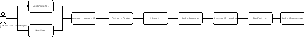

# salesportal
Insurance Sales Portal applications Repository
**Problem:**  Buying or Enrolling in an Insurance Policy

**Description:** A high-level architecture for enrolling and buying an insurance policy.  It involves several key components and considerations. Below is a structured approach outlining the main components, their interactions, overall flow, and architecture diagrams:

**High-Level Architecture Components**

1. **User Interface (UI)**
   1. Web Portal
   1. Mobile Application
1. **Application Layer**
   1. API Gateway
   1. Authentication and Authorization
   1. User Management
   1. Policy Management
1. **Business Logic Layer**
   1. Product Catalog
   1. Quote Generation
   1. Underwriting
   1. Policy Issuance
   1. Payment Processing
   1. Notifications and Communications
1. **Data Layer**
   1. User Data
   1. Policy Data
   1. Product Data
   1. Transaction Data
1. **External Integrations**
   1. Payment Gateways
   1. External Underwriting Services
   1. Customer Verification (KYC)
   1. Email/SMS Services

**Component Descriptions**

1. **User Interface (UI)**
   1. **Web Portal**: A responsive website where users can view insurance products, get quotes, and enroll in policies.
   1. **Mobile Application**: An app for smartphones and tablets with similar functionalities as the web portal.
1. **Application Layer**
   1. **API Gateway**: Manages and routes API requests from the UI to the appropriate microservices.
   1. **Authentication and Authorization**: Handles user login, registration, and access control using OAuth2 or similar protocols.
   1. **User Management**: Manages user profiles, preferences, and history.
   1. **Policy Management**: Handles policy lifecycle including creation, updates, renewals, and cancellations.
1. **Business Logic Layer**
   1. **Product Catalog**: Stores information about available insurance products and their details.
   1. **Quote Generation**: Provides instant quotes based on user input and predefined rules.
   1. **Underwriting**: Evaluates risk and determines eligibility for insurance products.
   1. **Policy Issuance**: Finalizes the policy purchase and generates policy documents.
   1. **Payment Processing**: Integrates with payment gateways to handle premium payments.
   1. **Notifications and Communications**: Sends emails, SMS, or push notifications for various stages of the policy lifecycle.
1. **Data Layer**
   1. **User Data**: Stores user information, preferences, and interactions.
   1. **Policy Data**: Maintains records of policies, including terms, conditions, and status.
   1. **Product Data**: Contains details of insurance products offered.
   1. **Transaction Data**: Logs all financial transactions and payment history.
1. **External Integrations**
   1. **Payment Gateways**: Integrates with financial services for processing payments.
   1. **External Underwriting Services**: Interfaces with third-party services for additional risk assessment.
   1. **Customer Verification (KYC)**: Integrates with identity verification services to ensure compliance.
   1. **Email/SMS Services**: Sends transactional and promotional messages to users.

**Process Flow**

1. **User Registration/Login**:
   1. User signs up or logs in through the web portal or mobile app.
   1. Authentication and Authorization services verify credentials.
1. **Browsing Insurance Products**:
   1. User browses available insurance products via the Product Catalog.
1. **Getting a Quote**:
   1. User inputs required information (e.g., personal details, coverage preferences).
   1. Quote Generation service calculates and displays the premium.
1. **Underwriting**:
   1. User submits an application for the desired policy.
   1. Underwriting service evaluates risk and determines eligibility.
1. **Policy Issuance**:
   1. If approved, the Policy Issuance service generates policy documents.
   1. User reviews and accepts the policy terms.
1. **Payment Processing**:
   1. Users make the payment through the integrated Payment Gateway.
   1. Transaction data is logged, and the policy becomes active.
1. **Notifications**:
   1. Confirmation and policy documents are sent to the user via email/SMS.
   1. Reminders and updates are sent periodically.
1. **Policy Management**:
   1. Users can view, update, or renew their policies through the portal/app.

**Non-Functional Requirements**

When designing a system for buying or enrolling in an insurance policy, several non-functional requirements (NFRs) need to be considered to ensure the system is robust, scalable, secure, and user-friendly. Here are the key non-functional requirements for this design:

**1. Performance**

- **Response Time**: The system should provide quick responses, especially for critical actions like quote generation and payment processing. Target response times should be less than 2 seconds for most operations.
- **Throughput**: The system must handle a high number of concurrent users, especially during peak times, without significant degradation in performance.
- **Scalability**: The architecture should support both vertical and horizontal scaling to handle increasing loads as the number of users grows.

**2. Reliability**

- **Availability**: The system should have high availability, targeting 99.9% uptime or higher, ensuring it is always accessible to users.
- **Fault Tolerance**: Implement mechanisms such as redundancy and failover to ensure the system remains operational in the event of hardware or software failures.

**3. Security**

- **Data Protection**: Ensure data at rest and in transit is encrypted using industry-standard protocols (e.g., AES-256, TLS).
- **Access Control**: Implement robust authentication and authorization mechanisms to prevent unauthorized access.
- **Compliance**: Ensure the system complies with relevant regulations and standards (e.g., HIPAA, PCI-DSS) to protect user data and maintain privacy.
- **Audit Logging**: Maintain comprehensive logs of all transactions and access to detect and investigate any suspicious activities.

**4. Usability**

- **User Experience (UX)**: Design a user-friendly interface with intuitive navigation, clear instructions, and helpful feedback to enhance the user experience.
- **Accessibility**: Ensure the system is accessible to users with disabilities by adhering to accessibility standards such as WCAG 2.1.
- **Multi-Platform Support**: The system should be responsive and function seamlessly on various devices (e.g., desktops, tablets, smartphones).

**5. Maintainability**

- **Code Quality**: Write clean, modular, and well-documented code to make it easier to maintain and extend.
- **Error Handling**: Implement comprehensive error handling to manage and log exceptions gracefully.
- **Monitoring and Alerts**: Set up monitoring and alerting systems to detect and respond to issues promptly.

**6. Interoperability**

- **Integration with External Systems**: Ensure seamless integration with third-party services such as payment gateways, underwriting services, and customer verification systems through well-defined APIs.
- **Data Exchange Standards**: Use standard data formats (e.g., JSON, XML) for exchanging information with external systems to ensure compatibility.

**7. Scalability**

- **Horizontal and Vertical Scaling**: Design the system to scale both horizontally (adding more servers) and vertically (adding more power to existing servers) to handle increased load.
- **Load Balancing**: Implement load balancers to distribute incoming requests evenly across servers to prevent any single server from becoming a bottleneck.

**8. Disaster Recovery**

- **Backup and Restore**: Regularly back up critical data and ensure there are processes in place for restoring data in case of data loss.
- **Disaster Recovery Plan**: Develop and test a disaster recovery plan to ensure the system can be restored quickly in case of a catastrophic failure.

**9. Compliance and Legal**

- **Regulatory Compliance**: Ensure the system adheres to all relevant legal and regulatory requirements, such as data protection laws and financial regulations.
- **Auditability**: Maintain detailed records of all transactions and system interactions for audit purposes.

**10. Localization and Internationalization**

- **Language Support**: Support multiple languages and regional formats to cater to a global user base.
- **Currency and Tax Handling**: Handle multiple currencies and tax regulations based on the user’s location.

**11. Cost Efficiency**

- **Resource Optimization**: Optimize the use of computational and storage resources to keep operational costs low.
- **Cost Monitoring**: Implement tools to monitor and manage the costs associated with running the system, particularly when using cloud services.

By considering these non-functional requirements, the system for buying or enrolling in an insurance policy will be well-equipped to provide a reliable, secure, and efficient service to its users, while also being easy to maintain and scale.

**Architecture Diagrams:**

)

**Security Model**

|**User Management API**|
| :- |
| |
|GET /users - Retrieve a list of all users|
|GET /users/{id} - Retrieve a specific user by ID|
|POST /users - Create a new user|
|PUT /users/{id} - Update an existing user|
|DELETE /users/{id} - Delete a user by ID|
|User Authentication|
| |
|POST /users/login - User login|
|POST /users/logout - User logout|
|POST /users/register - User registration|
|User Profile Management|
| |
|GET /users/{id}/profile - Retrieve user profile information|
|PUT /users/{id}/profile - Update user profile information|
|User Roles and Permissions|
| |
|GET /users/{id}/roles - Retrieve roles for a user|
|PUT /users/{id}/roles - Update roles for a user|
|GET /users/roles - Retrieve all available roles|
|Password Management|
| |
|POST /users/{id}/password/reset - Request a password reset|
|PUT /users/{id}/password - Update user password|
|User Activity|
| |
|GET /users/{id}/activity - Retrieve user activity log|

**Overall Architecture of the application:**

**Microservice Considerations.**

Designing a microservices architecture involves adhering to a set of best practices and design principles to ensure that the system is scalable, maintainable, and resilient. Here are the top microservice design rules:

**1. Single Responsibility Principle**

Each microservice should have a single responsibility, focusing on a specific business capability or domain. This keeps services simple and easier to understand, develop, and maintain.

**2. Loose Coupling**

Microservices should be loosely coupled, meaning they can be developed, deployed, and scaled independently of each other. This reduces dependencies and allows teams to work autonomously.

**3. High Cohesion**

Ensure that each microservice is highly cohesive, meaning that its internal components are closely related in functionality. This improves maintainability and reduces the complexity of service interactions.

**4. API-First Design**

Design APIs first before implementing the microservices. This ensures clear contracts between services and facilitates better integration and communication. Use well-defined, versioned APIs.

**5. Data Decentralization**

Each microservice should manage its own database to avoid direct dependencies on shared data sources. This aligns with the principle of autonomy and helps to avoid bottlenecks and single points of failure.

**6. Statelessness**

Microservices should be stateless where possible. Store stateful information in a distributed cache or a database to ensure that services can be easily scaled and are resilient to failures.

**7. Service Discovery**

Implement a service discovery mechanism to dynamically locate microservices. This allows services to find each other without hardcoding addresses, facilitating scaling and dynamic configuration changes.

**8. Asynchronous Communication**

Prefer asynchronous communication (e.g., messaging queues, event streams) between microservices to decouple service interactions, improve performance, and increase resilience to failures.

**9. Resilience and Fault Tolerance**

Design microservices to be resilient and fault-tolerant. Implement patterns such as circuit breakers, retries with exponential backoff, and fallbacks to handle failures gracefully.

**10. Monitoring and Logging**

Implement comprehensive monitoring and centralized logging for each microservice. This enables real-time insights into service health and performance, and aids in troubleshooting issues.

**11. Security**

Ensure security is built into each microservice from the start. Use authentication and authorization mechanisms (e.g., OAuth2, JWT), encrypt data in transit and at rest, and follow the principle of least privilege.

**12. Automation**

Automate deployment, scaling, and recovery processes using CI/CD pipelines and infrastructure as code. This reduces human error and improves the speed and reliability of deployments.

**13. Scalability**

Design microservices to be scalable both vertically and horizontally. Use container orchestration tools like Kubernetes to manage scaling and resource allocation automatically.

**14. Versioning**

Implement API versioning to manage changes over time without breaking existing clients. This allows for backward compatibility and smooth transitions when updating services.

**15. Inter-Service Communication Protocols**

Choose appropriate communication protocols based on the use case. For example, use REST or gRPC for request-response communication and Kafka or RabbitMQ for event-driven communication.

**16. Consistent Data Contracts**

Ensure that data contracts (schemas) are consistent and well-defined. Use tools like Protobuf or Avro for defining data schemas that are language-agnostic and can be shared across services.

**17. Polyglot Persistence**

Allow the use of different types of databases and storage solutions tailored to the specific needs of each microservice. This enables optimized data management and performance.

**18. Independent Deployment**

Each microservice should be deployable independently without affecting the operation of other services. This supports continuous deployment and faster delivery cycles.

**19. Transactional Integrity**

Implement mechanisms to handle distributed transactions and maintain data consistency across services. Use patterns like Saga for managing long-running transactions and ensuring eventual consistency.

|**Technical Stack**|**Description**|
| :-: | :-: |
|**AWS Lambda**|Serverless functions|
|**AWS Fargate**|Serverless containers|
|**Amazon ECS / Amazon EKS**|Container management as a service|
|**Amazon EC2**|Infrastructure as a service|
|**Java 8**|For Rest APIs|
|**Spring Boot**|For Rest APIs|
|**React JS/Angular JS**|Front End development|
|**SNS**|Distributing the Messages|
|**Dynamo DB/Mongo DB**|Data store|
|**API Gateway**| |
|**Cognito**|` `Authorization & Authentication|
|**Amplyfy**| |
|**Node Js**| |
|**Nginx**|
 

|
|||

**AWS Shield**

**AWS Shield** is a managed Distributed Denial of Service (DDoS) protection service that safeguards applications running on AWS. It provides two levels of protection: Standard and Advanced.

**AWS Shield Standard**

- **Automatic Protection:** Automatically included at no extra cost with AWS services like Amazon CloudFront and Amazon Route 53.
- **Protection Against Common Attacks:** Defends against the most common network and transport layer DDoS attacks.
- **24/7 Coverage:** Always-on detection and automatic inline mitigations minimize application downtime and latency.

**AWS Shield Advanced**

- **Enhanced DDoS Protection:** Provides additional detection and mitigation against large and sophisticated DDoS attacks.
- **Near Real-Time Visibility:** Offers near real-time attack visibility and reports with detailed diagnostics.
- **Advanced Threat Intelligence:** Leverages AWS's global threat environment to detect and mitigate sophisticated DDoS attacks.
- **24/7 Access to DDoS Experts:** Provides access to the AWS DDoS Response Team (DRT) for assistance during significant DDoS events.
- **Financial Protections:** Includes cost protection for scaling charges that result from DDoS attacks.
- **Global Threat Environment Dashboard:** Offers insights into current DDoS trends and AWS Shield activity.

**Benefits of AWS Shield**

- **Improved Application Availability:** Protects applications from DDoS attacks, ensuring high availability and responsiveness.
- **Reduced Risk:** Minimizes the risk of application downtime and financial loss due to DDoS attacks.
- **Simplified DDoS Protection:** Easy to use and integrate with AWS services, providing seamless protection.
- **Cost Efficiency:** AWS Shield Standard is available at no additional cost, while AWS Shield Advanced offers comprehensive protection at a predictable price.

**AWS WAF:**

**AWS WAF (Web Application Firewall)** is a web application firewall that helps protect your web applications or APIs against common web exploits and vulnerabilities. It enables you to control how traffic reaches your applications by allowing you to create custom security rules that block common attack patterns such as SQL injection or cross-site scripting (XSS).

**Key Features of AWS WAF**

- **Customizable Web Security Rules:** Create rules to allow, block, or count web requests based on conditions you define, such as IP addresses, HTTP headers, HTTP body, or URI strings.
- **Managed Rule Groups:** Access a range of pre-configured rules managed by AWS or third parties to protect against common threats.
- **Bot Control:** Manage bot traffic by allowing good bots (e.g., search engines) and blocking bad bots (e.g., content scrapers).
- **Real-Time Visibility:** Get real-time visibility into web traffic and security metrics with integrated dashboards and logging.
- **Integration with AWS Services:** Seamlessly integrates with Amazon CloudFront, AWS Application Load Balancer (ALB), Amazon API Gateway, and AWS AppSync to protect your web applications and APIs.
- **Rate-Based Rules:** Automatically block or throttle requests from IPs that exceed a defined request rate.

**Benefits of AWS WAF**

- **Enhanced Security:** Protects your web applications from common threats and vulnerabilities, reducing the risk of data breaches and service disruptions.
- **Scalability:** Automatically scales with your web traffic, ensuring consistent protection regardless of traffic volume.
- **Cost Efficiency:** Pay only for what you use, with no upfront costs or minimum fees, making it a cost-effective solution for web application security.
- **Ease of Use:** Simplifies the process of setting up and managing web security rules, reducing the complexity of web application security management.
- **Improved Performance:** Provides protection with minimal impact on latency, ensuring that your web applications remain responsive.

Useful URLs

[API Gateway: 5 Key Capabilities (solo.io)](https://www.solo.io/topics/api-gateway/)

[Authentication Service - Customer IAM (CIAM) - Amazon Cognito - AWS](https://aws.amazon.com/cognito/)

[Full Stack Development - Web and Mobile Apps - AWS Amplify (amazon.com)](https://aws.amazon.com/amplify/)

[React](https://react.dev/)

